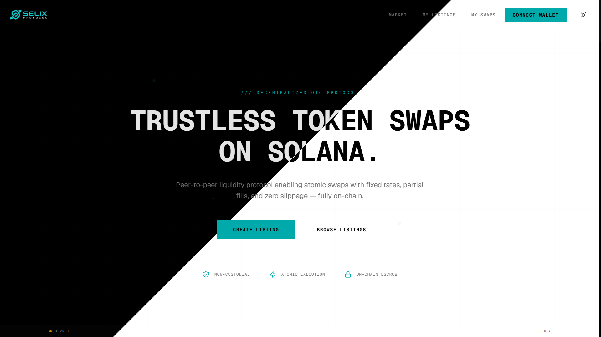

# Selix Protocol



A decentralized token swap platform built on Solana using the Anchor framework. Selix enables peer-to-peer token exchanges with configurable parameters and platform-level controls.

## Features

- **Token Swap Listings** - Create listings with customizable amounts, slippage tolerance, and expiration
- **Partial Fill Support** - Execute swaps with minimum fill amounts for flexible trading
- **Platform Controls** - Admin dashboard for pause/resume, fee configuration, and token whitelisting
- **User Profiles** - Track activity, volume, and referral statistics on-chain
- **Vault-Based Escrow** - Secure token custody during active listings
- **Configurable Fees** - Platform fee collection with adjustable basis points

## Project Structure

```
selix/
├── selix-program/     # Solana program (Rust/Anchor)
└── web/               # Next.js frontend application
```

## Quick Start

### Prerequisites

- Node.js 18+ and Yarn
- Rust and Cargo
- Solana CLI tools
- Anchor CLI 0.32.1

### Installation

1. Clone the repository:
```bash
git clone https://github.com/exyness/selix.git
cd selix
```

2. Install dependencies:
```bash
# Install program dependencies
cd selix-program
yarn install

# Install web dependencies
cd ../web
yarn install
```

3. Build the program:
```bash
cd selix-program
anchor build
```

4. Run tests:
```bash
anchor test
```

5. Start the web application:
```bash
cd web
yarn dev
```

## Documentation

- [Program Documentation](./selix-program/README.md) - Solana program architecture and development
- [Web Documentation](./web/README.md) - Frontend application setup and features

## Technology Stack

### Solana Program
- **Language**: Rust
- **Framework**: Anchor 0.32.1
- **Token Standard**: SPL Token (Token-2022 compatible)

### Frontend
- **Framework**: Next.js 15 with App Router
- **Language**: TypeScript
- **Styling**: Tailwind CSS
- **Wallet**: Solana Wallet Adapter
- **State Management**: TanStack Query

## Key Concepts

### Listings
Users can create token swap listings by specifying:
- Source and destination token mints
- Amounts and exchange rates
- Slippage tolerance
- Expiration time
- Minimum fill amounts

### Swaps
Takers can execute swaps against active listings:
- Full or partial fills supported
- Automatic fee calculation and collection
- Vault-based token custody
- On-chain activity tracking

### Platform Management
Administrators can:
- Pause/resume platform operations
- Configure fee basis points
- Manage token whitelist
- Update platform parameters

## Security

- Overflow checks enabled in release builds
- Input validation for all instructions
- PDA-based account derivation
- Token account ownership verification
- Safe arithmetic operations

## Contributing

Contributions are welcome! Please feel free to submit a Pull Request.

## License

This project is licensed under the MIT License - see the [LICENSE](LICENSE) file for details.

## Support

For questions and support, please open an issue on GitHub.

## Acknowledgments

Built with [Anchor](https://www.anchor-lang.com/) on [Solana](https://solana.com/)
